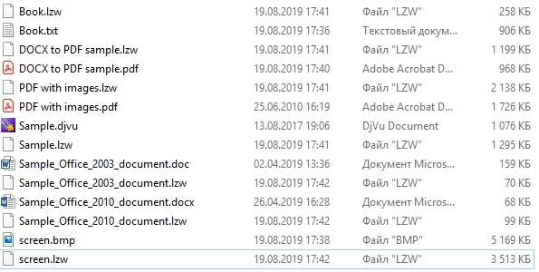

# LZWArchiver

Простой архиватор на Java, работающий по алгоритму LZW (Лемпеля-Зива-Велча). Состав классов проекта аналогичен тому, который был в моём [предыдущем проекте](https://github.com/SergeyLebidko/HArchiver). Отличаются только алгоритмы, использованные для кодирования/декодирования архива. В данном проекте также отсутствует дополнительный класс для предварительнго создания кодовой таблицы, так как алгоритм LZW создает свою таблицу (в отличие от алгоритма Хаффмана) на лету сразу же при упаковке/распаковке файла.

Также отмечу, что алгоритм LZW в целом лучше алгоритма Хаффмана, так как он гораздо сильнее сжимает простые текстовые файлы (txt), хорошо сжимает не сжатые изображения (bmp) и файлы в формате doc. А вот с pdf и docx всё гораздо сложнее и LZW показывает себя не с лучшей стороны. В данных форматах, по-видимому, уже применяются какие-то схемы сжатия данных и для сжатия этих файлов необходимо применение гораздо более сложных методик, чем алгоритм Лемпеля-Зива-Велча.

Интерфейс программы абсолютно аналогичен тому, который я использовал ранее в HArchiver и здесь я привожу только скриншот с примерами файлов и их архивов.

